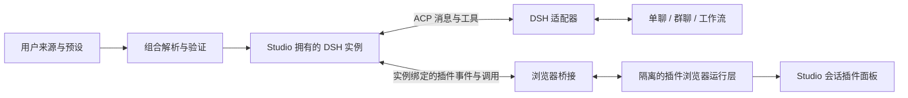

# DSH 配置复用与插件完整接入规划

日期：2026-09-11

修订：2026-09-12，规划 v0.2。补充可执行契约、任务依赖和发布门槛；没有新增运行时实现或真实兼容性测试结果。

后续进展：同日完成独立 M0 后端实验并补充证据链接；生产运行时未切换。

状态：Web 后端插件及预设用于 ACP 的部分接入已实现，当前边界见[实现记录](dsh-plugin-management-implementation.md)。完整目标尚未完成。T01/T02 的首轮固定 rc.1、macOS 后端实验已通过，见[兼容性证据](dsh-compatibility-evidence.md)。本文提交到 [PR #3011](https://github.com/EKKOLearnAI/hermes-studio/pull/3011)，不代表该 PR 已实现下面的完整插件能力。

实现基线：Studio `32027ae4`；真实 CLI 验证版本为 DSH `0.1.5-rc.1`。

阅读顺序：本文说明目标、产品行为和架构；[实施任务与验收契约](dsh-profiles-and-plugins-execution.md)定义接口示例、任务编号、依赖、故障行为及可直接执行的验收场景。两份文档都属于规划。

## 1. 目标与范围

用户在官方 DSH Web 中已有模型、插件、Agent 预设和 Skills。Studio 应能选择并复用这些配置，通过自己的单聊、群聊、工作流使用 DSH，避免要求用户重新配置一遍。

本规划覆盖配置发现、来源选择、预设绑定、插件管理、持续运行的 DSH 会话，以及浏览器插件的交互接入。保留已有 ACP 基础接入作为兼容路径，所有新增能力仅在 DSH 启用。

产品目标：

- 用户能看见“配置来自哪里、哪些内容实际生效、哪些能力暂不支持”。
- Web Profile 中可兼容的后端能力、预设工具和 Skills 在 Studio 中实际可用。
- scoped 模式使用 Studio 选择的模型；global 模式使用来源配置中的模型。
- 插件的安装状态、配置启用状态、实际运行状态和浏览器支持状态分别展示。
- 同一会话多轮对话保留进程内插件状态；退出 Studio 时清理 Studio 创建的进程。
- 官方 Web 正在运行时，Studio 不抢占其端口、不终止其进程、不默认改写其配置或会话文件。

本次文档提交不安装插件、不修改用户的 DSH 配置、不改变现有运行行为。后续也不承诺任意第三方插件无需适配即可在 Studio 中运行。

首个可发布版本限定为“受支持版本的官方 Web 来源 + 已验证的 Agent 预设 + 后端插件 + 多轮 ACP”。在该版本中，用户仍可使用完整的基础 ACP 路径；浏览器模式默认关闭。浏览器插件通过独立阶段交付，第一版不接管用户已经启动的官方 Web 服务，也不自动导入官方历史会话。

## 2. 当前能力与缺口

| 领域 | PR #3011 当前实现 | 待补齐 |
| --- | --- | --- |
| 安装 | 官方 DSH CLI 安装、检测、更新、卸载 | 插件依赖管理与 pnpm 可用性检查 |
| 设置 | 编辑共享 `AGENTS.md`、`settings.yaml` | DSH Home、Profile、Agent 预设选择及来源展示 |
| Skills | 原生与共享目录中的 bundle、平铺 Markdown | 预设自带 Skills、插件贡献的 Skills、有效目录与冲突说明 |
| MCP | 共享 patch 中的原生 MCP，运行时注入 Studio MCP | Profile 与预设中的 MCP、配置来源及有效覆盖 |
| 配置复用 | 复制共享配置和 `profiles/acp` 到私有运行目录 | Web / 自定义 Profile 的组合解析、插件依赖与路径处理 |
| 会话 | 每轮启动 ACP，完成后关闭，下轮恢复原生会话 ID | 同一进程及原生会话处理多轮消息 |
| 流式输出 | 原生增量转发，按消息 ID 去重，ACP 工具事件 | 多轮连接中的归属、迟到事件、后台插件事件处理 |
| 插件界面 | 没有通用浏览器插件运行层 | 浏览器入口、交互、授权、状态与生命周期 |
| 使用入口 | 单聊、群聊、工作流已有 DSH | 三种入口传递同一套来源、预设与插件策略 |

当前实现说明见 [DSH integration](../dsh-management.md)。该文档描述已交付行为，本文描述后续设计，两者不能混为一谈。

## 3. 官方机制与设计约束

### 3.1 三种名称必须分开

| 概念 | 用途 | 示例 |
| --- | --- | --- |
| Studio / Hermes Profile | Studio 现有的模型及应用上下文 | `default`、用户已有 Profile |
| DSH 启动 Profile | 插件组合、依赖、patch 生命周期 | `web`、`acp`、自定义 Profile |
| DSH Agent 预设 | 会话的工具、提示词和 Skills 组合 | `standard`、`ptc`、`cordis` |

UI 使用“DSH 配置来源”和“Agent 预设”，数据字段使用 `sourceProfile`、`agentPreset`；不复用现有含义不同的 `profile` 字段。

### 3.2 Profile 与配置优先级

官方 Profile 位于 `$DSH_HOME/profiles/<name>`，其中 `package.json` 的 `dsh.profile.bundles` 定义组合顺序，`cordis.patch.yml` 定义 Profile 覆盖。

组合树的优先级为：

```text
按声明顺序加载 bundles
→ Profile/cordis.patch.yml
→ $DSH_HOME/cordis.patch.yml
→ 命令行 --patch
```

同一 Home 下的 `settings.yaml`、凭据和默认会话目录通常共享。插件注册的 settings namespace 还可能覆盖组合树里的 `config`；不能假设最后一个 `--patch` 能覆盖所有有效模型设置。

这不是对几个 YAML 对象做普通深合并：必须保留插件 ID、组合层级、禁用表达式、别名、相对路径及依赖关系。

### 3.3 ACP 不会自动继承 Web 预设

官方 `web` 组合禁用了一部分全局工具及 Skill 发现入口，将它们交给 Agent 预设提供。官方 ACP `newSession` 则直接创建 Agent，源码明确说明没有自动加入预设组合。

因此，直接复制 Web Profile 再增加 ACP 插件，可能得到“模型能回答，但没有正确工具和 Skills”的运行时。预设必须在 Agent 的正确 scope 中绑定，创建和恢复两条路径都要验证；不能假设标准 ACP 已有 `preset` 参数，也不能把整份预设扁平化成全局插件。

2026-09-12 对 rc.1 源码的进一步核对确认：`AgentPresets.mount(agentCtx, id)` 的受支持调用位置是 Agent 工厂的 `setup(agentCtx)`，子 Agent 使用 `composeFrom(childCtx, parentCtx)` 继承父预设的同一代组合。`agent/created` 已经处于发布阶段，不能作为补挂载方案。官方 ACP 当前拥有自己的 `setup`，没有把预设选择作为公开 ACP 配置项提供；“配置页能选预设”和“ACP 能正确绑定预设”仍是两个不同的交付条件。

### 3.4 浏览器声明不是整包分类开关

- 包的 `dsh.client.platform === "web"` 表示声明了浏览器部分，官方还检查 `./client` 导出。
- 一个包可以同时具有后端实现和浏览器实现；仅凭浏览器声明不能禁用整个包。
- 动态插件通过 `code.host`、`code.client` 定义；运行态提供 `hasClientHalf` 等信息。
- `dsh.bundle` 表示组合包，可以再引入其他包；检查一个 bundle 的 manifest 不等于检查了其全部插件。
- 没有浏览器声明不等于兼容 ACP。插件可能依赖 Web 服务、会话控制器、特定 host service，或者向 stdout 输出普通文本。

发现页可以静态标记“包含浏览器部分”；“可在当前运行时使用”必须结合组合依赖和实际能力验证，未知项保留为未知。

### 3.5 动态插件的寿命

官方动态插件定义保存在进程内存中，按会话隔离。`cordis_define` 定义，`cordis_run` 运行，`cordis_stop` 停止，`cordis_undefine` 删除定义。浏览器部分还需要客户端执行与结果回传。

会话日志保存了相关调用记录，但恢复日志不等于恢复内存中的插件。后续不自动重放历史安装、运行或其他有副作用的调用来伪造恢复。

## 4. 产品界面规划

DSH 保留现有配置侧栏，增加 DSH 专属入口。其他 Coding Agent 不出现这些页面。

| 页面 | 内容 | 主要操作 |
| --- | --- | --- |
| 配置来源 | Home、可用 Profile、版本、配置位置、当前来源 | 选择来源、检查兼容性、查看生效差异 |
| Agent 预设 | 官方、用户和外部 roots 的预设，描述与可用状态 | 选择默认预设、查看工具与 Skills；复制后编辑用户预设 |
| 插件 | 已安装依赖、组合实例、配置状态、运行状态 | 安装、更新、卸载、启停、配置、查看诊断 |
| Skills | 来源分组、有效集合、同名项及优先关系 | 查看、编辑用户文件、显式选择工作流 Skill |
| MCP | 各层声明与最终有效实例 | 添加、编辑、启停、连接测试、查看来源 |
| 设置 | 模型来源、原生偏好、支持的结构化设置与高级编辑 | 保存、丢弃、恢复继承值 |
| 会话插件面板 | 当前会话定义和运行的动态插件 | 允许、拒绝、运行、更新、停止、删除定义、打开交互界面 |

交互原则：

1. 新建 DSH 会话时展示配置来源、Agent 预设和模型模式，不把 Profile 隐藏在模型选择器里。
2. 默认编辑 Studio 覆盖。写回官方来源是单独、明确命名的用户操作，不由一次聊天隐式触发。
3. 官方预设及安装包内容只读；用户可复制为自定义预设后编辑。
4. 表单显示继承值、覆盖值及来源。恢复默认是删除覆盖，而不是写死当前默认值。
5. 保存失败保留草稿。并发修改使用 revision 检查，返回冲突而不是覆盖新内容。
6. 浏览器依赖、未满足的 host 依赖、启动失败分别显示，不统一标成“已启用”。
7. 插件配置优先接已有 schema / 官方公开设置接口；没有 schema 的插件提供有来源说明的高级 YAML 编辑，不推断任意表单。
8. 插件运行中的交互控件保留官方所需的允许 / 拒绝流程，不能直接复用当前 ACP 工具默认允许策略。
9. 所有可见文案覆盖现有全部语言，移动端提供完整的来源选择、错误信息和插件操作入口。

## 5. 配置来源与有效配置

### 5.1 发现与默认选择

初次发现只读取目录和元数据，不启动插件、不自动安装依赖。读取所选 Home 的 Profile manifest、patch、预设 roots 和可解析的依赖元数据。

- 保留现有 Home 解析方式，新增显式选择自定义 `DSH_HOME` 的能力；不擅自递归扫描整块磁盘。
- 选择的是 Studio 后端所在机器的 Home。手机或远程浏览器不直接浏览自己的文件系统；桌面本机选择器和服务器目录选择器须明确区分。
- 现有会话保持当前 `acp` 来源，迁移不能静默改变模型或工具集合。
- 新会话在存在可识别的 Web Profile 时可将其作为候选推荐；通过兼容性检查才可作为有效来源。不存在时继续使用 ACP。
- 已安装、可解析、可启动是三个状态。缺少 pnpm、缺少依赖、Profile 损坏应分别诊断。
- 官方 Desktop Profile 有自己的管理约束，第一阶段只展示可发现的信息，不通过普通 CLI 修改桌面应用拥有的 Profile。

“配置目录有效”“静态组合可解析”“已在该版本实际验证”分别记录。只读发现不得隐式执行 `--dump-config`、`!!js` 或插件模块；这些操作可能执行用户代码。真实探测只在明确的兼容性测试或启动流程中进行，使用测试 Home 和受控输入，同时说明它不是第三方代码的安全沙箱。

### 5.2 数据模型草案

以下为设计字段，尚未添加到 API 或数据库：

```ts
interface DshRuntimeSelection {
  schemaVersion: 1
  sourceId: string               // 服务器登记的 Home 引用，客户端不直接拼接路径
  sourceProfile: string          // DSH Profile，与 Studio profile 分离
  agentPreset: string | null     // null 表示明确采用基础 ACP，不表示任意回退
  modelMode: 'scoped' | 'global'
  browserMode: 'off' | 'enabled'
}

interface DshResolvedRevision {
  sourceRevision: string
  overrideRevision: string
  compositionRevision: string
  adapterVersion: string
}
```

来源绑定和覆盖版本持久化在 Studio 自有状态中，不将密钥写入会话或工作流 JSON。会话、群成员和工作流节点均保存 selection；每次实际运行固定解析版本，不能在同一轮中途更换来源。

选择 Web 来源的“默认预设”时，先按该来源的默认策略解析为具体 ID，再保存到新会话。`agentPreset: null` 只允许基础 ACP，不用于表达“稍后猜测 Web 默认值”。来源改变后，既有会话继续使用已固定的组合；用户显式应用更新后才创建新实例。

工作流导出只保存可移植的逻辑引用；导入时重新绑定本机来源，不携带用户绝对 Home 路径或凭据。

### 5.3 来源、快照和运行目录

建议生成以下逻辑结构，具体目录名在实现时沿用 Studio 现有状态帮助函数：

```text
<Studio state>/coding-agents/dsh/
  sources/<sourceId>/                 # 来源登记、用户覆盖、修订信息
  compositions/<revision>/           # 验证后的组合与依赖快照
  runtimes/<ownerKey>/                # 私有 DSH_HOME、会话、插件运行数据
```

运行目录使用独立 Studio Profile，例如 `studio-acp`，而不是直接以 `--profile web` 代替 ACP 启动。来源 Profile 的配置作为输入，不等于启动其 Web 应用入口。

依赖和路径处理必须验证：

- 保留来源模块的解析锚点；相对 `include`、本地插件路径、预设资产路径不能在复制后改变含义。
- 不每轮复制整个 `node_modules`。以依赖锁定信息生成可复用的版本化快照，并验证 pnpm 链接在 macOS、Linux、Windows 下可解析。
- 配置和运行状态采用独立副本，不将可写运行目录链接回来源；旧 revision 保留到使用它的实例结束。
- 更新快照时明确处理已删除的文件，避免当前递归覆盖复制留下旧插件或旧 patch。
- 使用 YAML AST 保留注释、anchors 和 `!!js`。管理 API 不执行任意表达式；需要求值时由受控的 DSH 兼容性探测执行，结果标明环境并脱敏。
- 来源凭据保留官方引用语义；需要私有文件时设置适当权限。API、日志、诊断导出均不返回明文密钥。

### 5.4 覆盖与冲突规则

先按官方规则解释来源，再施加 Studio 覆盖，最后强制运行时约束。显示每项来源和覆盖原因，不导出一个无法解释的混合 YAML。

| 内容 | 规则 |
| --- | --- |
| scoped 模型 | Studio provider/model/reasoning 选择优先；仍通过本地代理传输及计费 |
| global 模型 | 沿用来源的原生路由，避免 Studio 默认模型将其覆盖 |
| settings namespace | 单独处理其对组合 config 的覆盖，不把它混入普通 patch 优先级 |
| Agent 预设 | 按选择绑定到 Agent scope；恢复时验证与会话元数据一致 |
| 普通用户插件、MCP | 默认继承有效来源；只在明确兼容规则或用户覆盖下改变 |
| Studio managed MCP | 保留 Studio 拥有的命名及环境，禁止重复注入；每个 launch env 含 `ELECTRON_RUN_AS_NODE: '1'` |
| 协议与存储 | ACP stdout、私有持久化路径和实例归属由 Studio 负责 |
| 冲突的应用入口 | 只处理识别出的 Web 启动、端口与浏览器自动打开行为；未知依赖不能靠名称猜测移除 |
| Skills | 保留官方全局层、预设层和提供者语义；列出实际有效目录与遮蔽关系，不自行发明统一排序 |

scoped 模式还要覆盖压缩、子 Agent、插件发起的模型调用：它们不能因为来源里存在其他凭据就悄悄绕过 Studio 模型策略。第一版以当前选择的模型为默认允许路由；来源要求额外路由时明确报告不兼容，后续可增加显式的多模型映射。普通第三方插件的任意网络请求不属于此模型路由保证，也不能通过复制运行目录声称已经隔离。

## 6. 组合与预设适配

实现前必须完成真实 Loader 验证，分三种路径：

| 来源 | 处理策略 |
| --- | --- |
| 基础 ACP | 保持现有能力，作为独立可用的兼容路径 |
| 已知版本的官方 Web | 通过版本化适配规则复用 host 能力和预设机制，调整应用入口，再提供 ACP |
| 自定义 Profile / 第三方组合 | 展示解析及依赖报告；无法证明可兼容时给出明确原因，不静默删插件后启动 |

预设绑定必须由创建/恢复工厂的 `setup` 调用 `AgentPresets.mount`，在工具目录、提示词、Skills 读取前完成加入。子 Agent 使用 `composeFrom` 继承父实例的组合代，不重新按预设名加载最新文件。需要覆盖新建、恢复、子 Agent 继承和两个不同预设并存。

默认实施路径是为 rc.1 准备版本固定的 Studio ACP 适配插件，显式提供预设选择及工厂 setup；在 M0 先核对所需 API 是否实际发布，再确定维护范围。如果后续官方版本提供等价接口，则切换到官方实现。上游改进可另外提交，但不将上游尚未发布的能力当成本项目已具备的依赖。

不得修改全局 npm 安装、从未发布的源码子路径导入运行时代码，或使用时序猜测式 monkey patch。若需要维护协议适配代码，记录上游版本、许可证、维护文件范围和标准 ACP 回归测试。无法以明确维护成本通过 M0 时，继续交付基础 ACP，Web 预设保持不可用并显示原因。

私有适配插件须声明自身能力版本；缺少能力时不发送未经声明的预设参数或插件请求。插件管理、浏览器交互和持久化屏障属于 Studio 扩展，不伪装成 ACP 标准方法。

## 7. 插件管理

### 7.1 分开管理包、组合实例和运行实例

| 对象 | 唯一标识 | 管理内容 |
| --- | --- | --- |
| 安装依赖 | Profile + 包名 | spec、解析版本、安装来源、bundle 声明 |
| 组合实例 | composition revision + scope + entry ID | 配置、依赖、启停、继承关系；同一个包可以有多个实例 |
| 动态插件 | runtime + native session + plugin ID | 定义版本、运行状态、浏览器部分、允许状态 |

删除一个实例不等于卸载整个包，禁用不等于删除配置。`dsh.client` 和 `./client` 只说明浏览器入口，不能据此推断是否存在有意义的后端功能。

### 7.2 包操作

优先复用官方 `dsh plugin --profile <name>` 和 pnpm 的 bundle reconcile 语义，命令使用参数数组。

- 安装到 Studio 管理的目标 Profile；明确选择写回来源时才修改原始 Profile。
- 第一期覆盖 registry 包和明确版本。Git、本地目录、tarball 等来源在独立验证路径完成后开放，不把整个 CLI 参数串暴露给前端。
- 检查包名、版本和操作范围，处理 CLI、pnpm 缺失及依赖构建失败；构建脚本策略沿用包管理器机制，不自动放开所有包。
- 对同一目标串行修改。在 staging 中安装、解析和检查，再发布新 revision；失败保留旧可用 revision。
- 更新和卸载不修改正在使用的依赖快照；UI 显示“下次启动生效”或由用户选择重启空闲实例。
- 普通库没有 `dsh.bundle` 时显示“依赖”，不伪装成已经启用的插件。

### 7.3 配置和诊断

优先读取官方 inventory / settings 能力；没有运行实例时展示静态配置状态，不伪造 live phase。只有明确由 Studio 持有的实例才可做运行态操作。

同一条诊断应包含插件 entry ID、来源、作用域、所需服务、缺失原因和修复入口。后端加载失败、客户端入口缺失、等待依赖、用户禁用、条件表达式未解析各自独立。

浏览器模式关闭时：经验证可独立工作的后端部分继续运行；明确要求 client 回应的功能标为不可用，在模型工具目录中不发布不可完成的交互工具，或在调用时立即返回明确的结构化不支持结果。未知依赖阻止发布该组合，而不是无限等待浏览器或假装调用成功。静态包带 `dsh.client` 与动态定义带 `code.client` 采用同一能力语义，但分别处理其生命周期。

## 8. 持续运行与生命周期

将目前每轮使用的 `DshAcpTurn` 职责拆分为持久连接 / 会话与单次 prompt 请求。ACP `initialize`、`session/new` 或 `session/resume` 每个实例只执行一次；普通轮次结束不执行 `session/close`，不关闭 stdin。

第一版采用“一个 owner 对应一个 DSH 进程和一个根原生会话”，不做跨单聊、群成员或工作流 execution 的进程池。owner 身份还需绑定 Studio 的权限/资料范围，不能只用来源或模型作为复用键。重建实例递增 generation，旧 PID 和旧授权不再拥有新的运行状态。

实例状态建议为：

```text
未启动 → 启动中 → 空闲 ↔ 执行本轮
                     ↓
                关闭中 → 已关闭
进程异常 → 已失败 → 显式恢复（不重放历史副作用）
```

关键规则：

- 一次 prompt 完成即完成这轮 Studio run，不能继续等待子进程退出；否则现有队列和工作流会一直挂起。
- 每轮完成时验证原生日志和 Studio 历史的持久化边界，不能继续依赖 `session/close` 才落盘。故障测试需要在完成一轮后直接终止进程，验证已完成历史可恢复。
- rc.1 已核对的 `AcpSession.close` 会调用 `ctx.sessions.flush`；标准 prompt 返回不作为等价持久化屏障。在 M0 验证非销毁式 flush 能力，由版本化适配器提供明确的完成屏障；屏障失败时不报告已可靠完成。测试需区分进程崩溃恢复与断电持久性，未验证文件系统同步语义时不承诺后者。
- 每轮分配独立的 response/run ID，清理该轮去重和工具状态；连接请求 ID 保持单调并绑定实例 generation，迟到响应不能落入下一轮。
- 取消停止当前 prompt。保留空闲进程与插件；“停止会话运行环境”才关闭整个实例。关闭时先取消、关闭原生会话，再 EOF，超时后清理拥有的进程树。
- 浏览器切换路由、隐藏面板或刷新不等于退出 Studio。服务关闭、显式关闭运行环境、会话删除时才触发对应实例清理。
- 保留插件状态的实例不沿用其他 Agent 的普通空闲淘汰逻辑。资源不足时拒绝新建并提示释放实例，不无提示销毁活动插件。
- 模型、来源、预设及插件 revision 的变化在轮次边界处理。需要重建的变更明确提示内存插件状态会丢失；预设变化初期通过新会话生效，避免恢复语义漂移。
- scoped 代理目标和 token 的寿命随实例管理；关闭时注销。上下文 usage 仍不作为账单，多次模型调用只通过既有代理账本计费。
- 插件后台事件与本轮回答分开路由；非 prompt 期间的事件不能合成新的 `run.completed`。后台模型活动、提示词刷新和上下文归属必须在真实多轮测试中验证。
- 崩溃后可恢复原生历史，但 UI 标明动态插件运行已中断。不能声称恢复原生 session ID 就恢复了所有插件。

进程仍存活但模型本轮失败时，保留进程的前提是适配器已回到可接收下一次 prompt 的空闲状态。取消超时或协议状态无法确认时终止该实例，说明插件状态中断；下一次使用通过原生历史恢复，不向疑似仍工作的实例继续发消息。

### 8.1 各使用入口的归属

| 入口 | 运行实例归属 | 清理与状态边界 |
| --- | --- | --- |
| 单聊 | Studio 会话 | 多轮复用；显式关闭或服务退出时释放 |
| 群聊 | 房间 + 成员 | 成员之间不共享动态插件状态；移除成员时释放该成员实例 |
| 工作流 | 工作流 execution + 节点 | 节点的连续调用可复用；执行完成、取消或失败后释放，不能跨不同 execution 复用 |

第一版工作流默认关闭浏览器交互，只允许已验证可无界面运行的能力。需要人工交互的节点必须明确进入等待状态并支持超时、取消，不能伪装成普通后台节点；此能力在浏览器阶段另行启用。

## 9. 浏览器插件运行层

这是独立交付阶段，不用 iframe 指向用户已有的 `localhost:3080` 来充当完成，也不把任意插件源码直接放进 Studio Vue 页面执行。

目标架构：



优先验证复用官方 client module loader、Cordis client runner 和 UI slots；这些组件依赖官方模块图、React 和 host Remotes，不能只取一段 `lib/client.js` 就假设能运行。

预研比较两个方案并形成决定记录：

| 方案 | 优点 | 必须验证的问题 |
| --- | --- | --- |
| 隔离页面复用官方最小客户端组合 | 能保留官方插件接口与 React slots，减少重写 | 构建产物、必要 UI 服务、鉴权、CSP、跨平台部署与版本耦合 |
| Studio 实现有限能力的客户端适配 | 更贴合现有界面 | 支持范围有限，不能声称兼容任意官方 UI 插件；需明确服务 allowlist |

第一选择是隔离页面复用官方机制，预研失败后才考虑有限适配。任何方案必须满足：

- 浏览器访问的是 Studio 拥有的 DSH 实例。端口动态分配或经受控代理承载，不占用用户官方 Web 的固定端口。
- 凭据使用实例绑定的短期授权，插件页面不获得 Studio 主应用 token。事件与调用校验来源、实例、原生会话、插件及运行版本。
- `postMessage` 校验 origin/source；不提供任意后端 RPC 转发器，不把 Node 全局或 Studio 任意管理 API 暴露给插件。
- 动态插件允许 / 拒绝及版本授权沿用官方语义，不能把“允许工具调用”等同于“允许浏览器代码”。
- UI 区分 host 已运行、client 未运行、等待允许、页面断开和渲染失败；两端状态不互相冒充。
- 刷新后重新查询定义和运行状态，按官方规则重新挂载或等待用户运行；停止、换版本、断连时处理组件、样式、订阅与 host 回调清理。
- 插件运行返回结果和后续渲染错误回传同一 DSH 会话；群聊由对应成员面板操作，不能共享一个未区分成员的默认会话。
- 保持传输边界：ACP 负责聊天，新增插件通道负责浏览器能力。若使用私有扩展，定义版本协商，不宣称为标准 ACP 原生能力。

在多标签页场景，插件定义属于原生会话，client 是否挂载属于具体页面。每个允许请求使用一次性 request ID，服务端原子结算；迟到的第二次响应不能重复启动 host。一个页面关闭不能替另一页面发出停止操作。暂不支持的多页面行为必须在面板中限制操作范围，并由真实客户端实验确定，不假设一个全局 `isRunning` 能表达两端状态。

## 10. 后端、API 与存储边界

DSH 具体逻辑放在 `modules/coding-agents`，通用会话字段和运行端口放在 Studio contracts/public，由 bootstrap 注入。Studio 通用层不直接导入 DSH 的具体服务实现。

建议拆分职责：

| 服务 | 职责 |
| --- | --- |
| source catalog | Home / Profile 发现、来源登记与 revision |
| composition resolver | 分层配置、模块解析、浏览器声明、兼容性与有效配置 |
| preset adapter | 原生预设目录、绑定、工具/Skills 的有效投影 |
| plugin manager | 包操作、组合实例配置、staging 与发布 |
| runtime session | 长连接、实例归属、prompt 生命周期、关闭与恢复 |
| browser bridge | 插件事件、授权、客户端状态及 host 调用 |

以下是拟议 API，不是已经实现或已由官方提供的接口：

| 操作 | 拟议 Studio API |
| --- | --- |
| 读取 / 登记来源 | `GET/POST /api/coding-agents/dsh/sources` |
| 列出 Profile 与预设 | `GET /api/coding-agents/dsh/sources/:sourceId/profiles`、`GET .../presets` |
| 预览有效配置 | `POST /api/coding-agents/dsh/config/resolve` |
| 保存来源选择 / 覆盖 | `PUT /api/coding-agents/dsh/config`，带期望 revision |
| 插件静态及运行清单 | `GET /api/coding-agents/dsh/plugins`，明确来源或 runtime scope |
| 安装 / 更新 / 卸载 | `POST /api/coding-agents/dsh/plugin-operations`，返回 operation ID |
| 修改组合实例 | `PATCH /api/coding-agents/dsh/plugin-instances/:instanceId` |
| 查询 / 关闭运行环境 | `GET/DELETE /api/coding-agents/dsh/runtimes/:runtimeId` |

插件事件优先扩展已有会话订阅，并增加 runtime、native session、generation、plugin、run/request 标识。长任务不依赖 HTTP 连接一直存活，操作进度与结果可重新读取。

路径和 Profile 名在服务器校验；写操作有 scope、revision 和并发锁。具体 route 按仓库已有模式接入 auth，新增接口记录 OpenAPI；不得绕过 Studio 授权直接暴露 DSH 的内部管理端口。

## 11. 分阶段实施与验收

阶段工作量以功能切片而非日期估算；预设和浏览器预研未通过前，不给完整兼容承诺。

| 阶段 | 交付内容 | 完成条件 |
| --- | --- | --- |
| M0：兼容性预研 | 官方版本基线、来源解析原型、预设绑定和双端插件实验、方案决定记录 | 真实 DSH 中证明预设工具/Skills 可用，同进程两轮状态保留；浏览器方案给出可运行最小实验或明确缺失接口 |
| M1：来源与预设 | Home/Profile 选择、有效配置说明、scoped/global 覆盖、预设绑定和 Skills/MCP 来源 | Web 来源下单聊实际使用选定预设；旧 ACP 会话不变；未知组合明确报错 |
| M2：持续会话 | 持久 ACP 连接、轮次完成与进程退出分离、取消、关闭、异常恢复 | 相同 PID/原生 session 连续两轮，插件状态仍在；取消后可继续；退出只清理 Studio 实例 |
| M3：原生插件管理 | 安装/更新/卸载、启停、实例配置、诊断、版本快照 | 真实本地测试插件生命周期通过；失败不破坏旧配置；更新不修改运行中的快照 |
| M4：浏览器能力 | 隔离客户端、交互面板、允许/拒绝、host/client 通道 | 真实动态双端插件可运行、交互、更新、停止；刷新与断线按定义处理，不串会话 |
| M5：三入口与发布 | 群成员、工作流、迁移、导入导出、文档及跨平台验证 | 单聊/群聊/工作流均正确传递配置和归属；其他 Coding Agent 回归通过 |

M1–M3 可以先交付“原生配置与后端插件支持”，UI 必须明确浏览器部分的可用边界。只有 M4 验收通过后，才描述为支持带界面的 DSH 插件。

每阶段独立提交，文档状态随实现更新；本次仅把规划加入 #3011，后续代码是否拆成多个 PR 依据阶段规模决定，不把未完成工作标成现有 PR 的实现成果。

可执行任务编号、依赖和逐项验收见[实施任务与验收契约](dsh-profiles-and-plugins-execution.md)。M0 拆为来源/预设验证、持续会话验证、浏览器验证三个门槛；浏览器验证未通过不阻塞已通过的后端阶段，但必须阻止开启浏览器能力。第一版完成指 M1、M2、M3 和无浏览器模式的三入口验收共同通过，不是仅完成配置页面。

## 12. 验证矩阵

| 验证层 | 必须覆盖的行为 |
| --- | --- |
| 配置解析 | 空/null YAML、覆盖顺序、注释/anchors/`!!js`、重复 ID、嵌套组、禁用父组、相对 include、来源删除 |
| 来源复用 | Web/acp/自定义 Profile、共享 settings 覆盖、scoped 模型固定、global 原模型不变、来源文件不被运行改写 |
| 预设 | `standard`/`cordis` 及用户预设；工具目录、提示词、预设 Skill 真实进入模型请求；不同预设及子 Agent scope 隔离 |
| 包管理 | bundle 与普通依赖、pnpm 不可用、安装失败、并发修改、依赖更新、卸载后无残留、快照回滚 |
| 插件判定 | 浏览器声明与入口一致性、双端插件、缺少 host 服务、未知动态配置、bundle 的间接依赖 |
| 多轮 ACP | 同 PID 多轮、仅一次初始化、prompt 正常完成不等进程退出、流式首段先于完成、最终去重、重复文本保留、工具与 reasoning 顺序 |
| 生命周期 | 取消后继续、关闭期间取消、异常 EOF、迟到通知、旧 generation 事件、服务退出清理、用户独立 DSH 不受影响 |
| 插件状态 | 定义后第二轮仍可调用；崩溃后显示中断；不重放有副作用的历史工具 |
| 浏览器真实组合 | 允许/拒绝、host 调用、渲染失败回传、刷新、版本更新、停止清理、跨会话请求拒绝 |
| 群聊 / 工作流 | 成员来源隔离、节点执行归属、后台无浏览器行为、取消清理、工作流导入重新绑定来源 |
| 其他 Agent | Claude/Codex/Pi/Grok/OpenCode 的启动、输出、恢复、取消、MCP、用量与队列行为保持兼容 |

测试方式：

- Vitest 使用临时 Home、假进程和本地 fixture 验证解析、接口及状态机。
- 真实 DSH 使用本地 SSE 模型和本地 fixture 插件，不消耗外部模型额度；至少证明两个回合由同一进程完成，以及所选预设确实影响有效工具/Skills。
- 浏览器 mock 测试验证设置和消息显示；浏览器插件兼容性另外通过真实官方 Loader/client runner 验证，不能用 mock UI 代替。
- 每个阶段执行相关最小测试及 `npm run harness:check`。涉及共享聊天、Socket.IO、持久化时按仓库要求执行 coverage、相关 Playwright 和 build。
- 真实 CLI 基线至少覆盖 macOS、Linux、Windows；检查 pnpm 路径、Electron Node 模式、端口与进程树回收。未验证平台明确标注，不能从单平台成功外推。

## 13. 迁移、回退与诊断

- 已有 DSH 会话缺少新字段时映射为基础 ACP，不自动切换 Web 或更换原生 session ID。
- 新的配置来源按会话固定；更换来源或预设初期创建新会话，保留旧会话和运行数据。
- 运行时切换采用 revision 发布，失败返回诊断并保留旧可用 revision；不把有问题的配置默默回退成无工具的默认 Agent。
- 回退功能版本时保留用户来源、覆盖及插件文件；恢复基础 ACP 会明确不包含新插件状态，不承诺迁移进程内定义。
- 诊断导出包含 DSH/适配器版本、Profile、预设、revision、脱敏的依赖/状态、退出原因；不包含凭据或完整私密提示词。
- 启动耗时、首段耗时、活动实例数、等待允许数及异常退出可用于排查；区分“模型尚未输出”“插件等待浏览器”“客户端断开”。

## 14. 未决项与决策门槛

| 问题 | 所需证据 | 决定点 |
| --- | --- | --- |
| ACP 创建/恢复如何绑定预设 | 已明确应在工厂 setup 中调用 mount；验证版本固定适配器可使用实际发布的 API | M0 结束前；不通过则不开放 Web 预设，不在 agent/created 补挂载 |
| 如何复用 Web 的 host 组合而不启动冲突入口 | 版本化组合报告和有效工具目录 | M0–M1，不采用包名前缀过滤 |
| 官方浏览器运行层能否独立嵌入 | 构建、slots、RPC、授权与 host/client 双向调用实验 | M0 形成选择，M4 完整验收 |
| 第三方配置的表达式和绝对路径如何迁移 | 原始解析锚点及隔离运行验证 | M1；无法迁移的项保持明确不兼容 |
| 插件操作是否修改官方来源 | UI 显式目标、revision 与可恢复写入机制 | M3；默认仅修改 Studio 管理目标 |
| 工作流如何等待浏览器 | execution 级状态、操作者归属、超时和恢复设计 | M4–M5；完成前默认关闭浏览器交互 |

这些是实现前要验证的技术问题，不要求用户先理解 Cordis 内部机制才能选择配置来源。

## 15. 依据与维护入口

官方行为核对使用源码快照，不以“最新版”作为兼容承诺：CLI/Profile/ACP/动态插件关键行为对照 `dsh-v0.1.5-rc.1`；扩展设计同时参考仓库快照 `c291e7961a515f6d7af9304e7fd1d257929aef26`。实施 M0 时重新记录实际测试版本，较新快照中的能力必须回查已安装版本。

| 官方源码 | 支持的事实 |
| --- | --- |
| [CLI Profile 文档](https://github.com/deepseek-ai/deepseek-harness/blob/dsh-v0.1.5-rc.1/apps/cli/README.md) | Profile 目录、组合顺序与 CLI 参数 |
| [插件 CLI](https://github.com/deepseek-ai/deepseek-harness/blob/dsh-v0.1.5-rc.1/apps/cli/src/plugin.ts) | pnpm 转发与 bundle reconcile |
| [ACP 会话入口](https://github.com/deepseek-ai/deepseek-harness/blob/dsh-v0.1.5-rc.1/packages/acp/acp/src/index.ts) | 创建 Agent 时不自动加入预设 |
| [ACP 会话创建与关闭](https://github.com/deepseek-ai/deepseek-harness/blob/dsh-v0.1.5-rc.1/packages/acp/acp/src/session.ts) | 工厂 setup、模型/MCP 安装与关闭时 flush |
| [预设组合接口](https://github.com/deepseek-ai/deepseek-harness/blob/dsh-v0.1.5-rc.1/packages/preset/agent-presets/src/index.ts) | mount 的合法时机与 composeFrom 的代际继承 |
| [Web 组合](https://github.com/deepseek-ai/deepseek-harness/blob/dsh-v0.1.5-rc.1/packages/bundle/web-app/cordis.patch.yml) | host、client 与预设层的关系 |
| [Agent 预设](https://github.com/deepseek-ai/deepseek-harness/blob/c291e7961a515f6d7af9304e7fd1d257929aef26/packages/preset/agent-presets/README.md) | 预设组合、来源、作用域及 Skills |
| [前端模块系统](https://github.com/deepseek-ai/deepseek-harness/blob/c291e7961a515f6d7af9304e7fd1d257929aef26/packages/client/modules/README.md) | `dsh.client`、浏览器 bundle 与模块加载 |
| [动态插件 host runner](https://github.com/deepseek-ai/deepseek-harness/blob/dsh-v0.1.5-rc.1/packages/extensions/cordis-host-runner/README.md) | 内存定义、双端运行、停止与恢复边界 |
| [动态插件 client runner](https://github.com/deepseek-ai/deepseek-harness/blob/c291e7961a515f6d7af9304e7fd1d257929aef26/packages/extensions/cordis-client-runner/README.md) | 用户允许、页面运行及结果回传 |

Studio 主要实施位置：

- `packages/server/src/modules/coding-agents/services/dsh/`：当前配置生成、ACP 会话和流式扩展，后续来源及插件服务。
- `packages/server/src/modules/coding-agents/services/runtime/run-manager.ts`：现有各 Agent 分发及 run 生命周期，DSH 改造保持独立分支。
- `packages/client/src/views/hermes/CodingAgentConfigView.vue` 和对应 sidebar：DSH 设置入口。
- `packages/server/src/modules/studio/contracts/` 与现有群聊/工作流适配端口：selection 和 runtime-neutral 事件。
- `tests/server/dsh-*.test.ts`、`tests/e2e/dsh-management.spec.ts`：当前回归基线，后续按上述矩阵补充。
